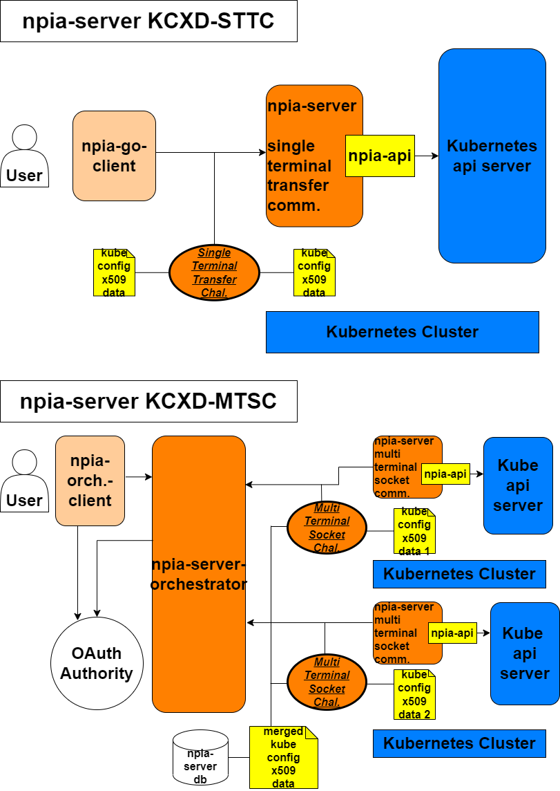
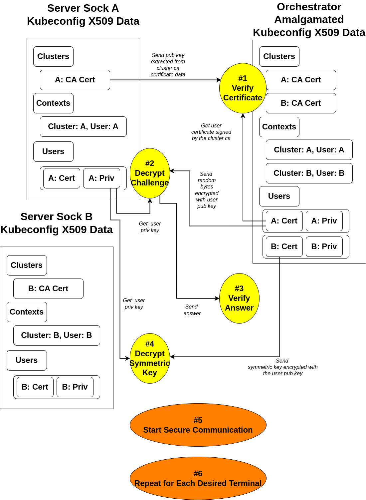
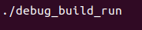
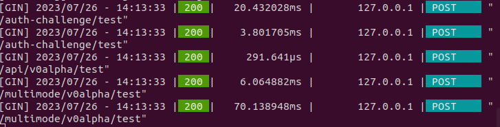
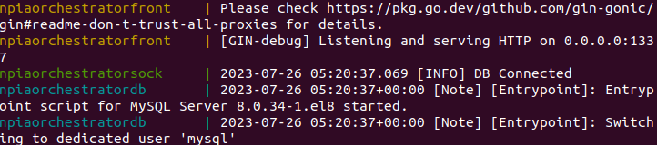
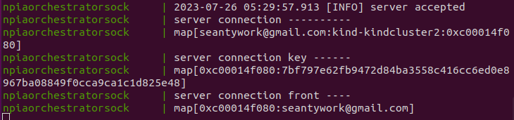
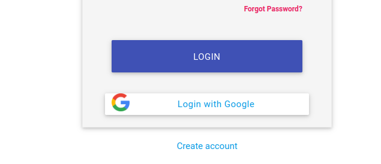
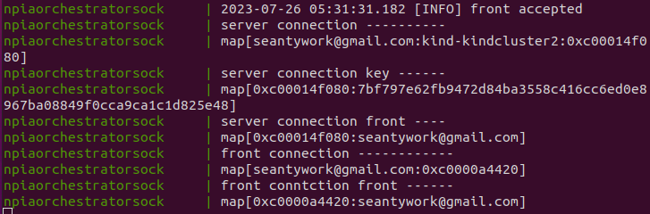
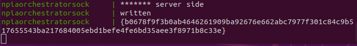

# npia-server

## Table of Contents


- [Description](#description)
- [Project Overview](#project-overview)
- [Details](#details)
- [Security Model](#security-model)
  - [Warning](#warning)
  - [Model Description](#model-description)
  - [Model Overview](#model-overview)
  - [Model Details](#model-details)
  - [Where Is The Code?](https://github.com/OKESTRO-AIDevOps/npia-server/blob/main/src/modules/auth.go)
- [Scenario](#scenario)
  - [Scenario Description](#scenario-description)
  - [Single Terminal Transfer Communication Mode](#single-terminal-transfer-communication-mode)
  - [Multi Terminal Socket Communication Mode](#multi-terminal-socket-communication-mode)

## Description

This project aims not only to demonstrate a proper use case for [npia-api](https://github.com/OKESTRO-AIDevOps/npia-api) but also to\
offer a production-ready implementation of npia-api compliant system (and as usual for me, it doesn't reach the level at this point ʘ‿ʘ).

This repository holds two examplary (and hopefully someday production-grade) systems that implement somewhat distinct \
interfaces to interact with npia-api. Each system is as follows.

1. Http server that implements KCXD-STTC Protocol (you think it's a bogus word? Well... it was until now! See [Security](security.md) section to\
   know what on earth that means) to handle secure http query from a compliant client, ex) [npia-go-client](https://github.com/seantywork/npia-go-client) 


2. Web socket hub that implements KCXD-MTSC Protocol (again, [Security](security.md)) to handle secure web socket query from a compliant client\
   ex) the code in src/sock directory implements this, ex2) also, orchestrator/ofront will implement this protocol in future release, but for now,\
   it relies on oauth2 based https connection for security. This means, oauth2 user must (**please!**) configure properly the external \
   reverse proxy (nginx, per se) to handle https:// and wss://.


## Project Overview

The blueprint for the repository is as follows.



The tree structure for the repository is as follows

```bash
├── debug_bin
├── debug_build_run
├── debug_cleanup
├── docs
├── go.mod
├── go.sum
├── LICENSE
├── orchestrator
│   ├── debug_amalgamate_bin
│   ├── debug_amalgamate_config
│   ├── docker-compose.yaml
│   ├── odb
│   ├── odebug_build_run
│   ├── odebug_cleanup
│   ├── ofront
│   │   ├── config.json
│   │   ├── ocontroller
│   │   ├── omodels
│   │   ├── omodules
│   │   ├── orouter
│   │   └── oview
│   └── osock
├── src
│   ├── controller
│   ├── modules
│   ├── router
│   └── sock
├── test
│   └── kindcluster
└── var

```

Let me guide you through the each entrypoint briefly.

- [debug_bin](#debug_bin)\
  Stores a kubeconfig file that holds information about two clusters for testing npia-server.

- debug_build_run\
  Is a Bash script for compiling and setting up the executable and base environment\ 
  for testing npia-server.  

- debug_cleanup\
  Is a Bash script for cleaning up the artifacts and environment used for testing\
  npia-server.

- docs\
  Is what it says it is.

- go.mod, go.sum\
  Define the directly and indirectly required modules for functioning apis.

- LICENSE\
  Is what it says it is.

- [orchestrator](#orchestrator)\
  Stores a docker-compose manifest file for building and running components that make up\
  orchestrator system while also has Bash scripts for testing it\
  **Caveats: if you already have a running cluster and corresponding kubeconfig file,\
  DO NOT run the script "odebug_build_run" without backing up your original\
  kubeconfig, because the script will obliterate that one**


- [orchestrator/debug_amalgamate_bin](#orchestrator-debug_amalgamate_bin)\
  Stores "amalgamation tools" used when testing the orchestrator system, which means that\
  the tools handle automatically baseline components needed for having a functioning\
  orchestrator system, including merging two test kubeconfig files into one and then\
  generating encryption key and putting encrypted merged file into the db  

- [orchestrator/debug_amalgamate_config](#orchestrator-debug_amalgamate_config)\
  Stores the two test kubeconfig files used for testing the orchestrator system


- [orchestrator/odb](#orchestrator-odb)\
  Stores image and container information for running orchestrator database.


- [orchestrator/ofront](#orchestrator-ofront)\
  Holds the front part (meaning user-facing on the browser) of the orchestrator system, including\
  configuration file needed for Google oauth.


- [orchestrator/ofront/ocontroller](#orchestrator-ofront-ocontroller)\
  Stores controller logic for handling user request regarding access and oauth authentication.


- [orchestrator/ofront/omodels](#orchestrator-ofront-omodels)\
  Stores database querying logic for handling user request regarding access and \
  oauth authentication and also storing orchestrator socket request key. 


- [orchestrator/ofront/omodules](#orchestrator-ofront-omodules)\
  Stores orchestrator gadgets that include primarily oauth modules and configuration.


- [orchestrator/ofront/orouter](#orchestrator-ofront-orouter)\
  Stores access paths information for users to access the orchestrator.
      

- [orchestrator/ofront/oview](#orchestrator-ofront-oview)\
  Stores html and template assets to render on the user's browser.


- [orchestrator/osock](#orchestrator-osock)\
  Stores socket connection endpoints and handling logic for both oauth-ed front user and \
  challenge-passed server socket client and the hub channels for both sides to talk to each\
  other. 

- [src](#src)\
  Stores entry and initiation logic for both npia-server STTC host and npia-server MTSC client.

- [src/controller](#src-controller)\
  Stores various data structures and logic for interacting with npia-server that inlcude\
  npia-api wrapper, challenge protocol handler, network communication data structures, and\
  npia-multi-mode handler so and so.
  The data structure and logic defined and implemented in here are used across,\
  but not limited to, this project. Those are exported to other projects such as\
  npia-go-client.

- [src/modules](#src-modules)\
  Stores various data structures and logic primarily related to asymmetric/symmetric\
  encryption/decryption algorithms and certificate authentication methods that are all\
  building blocks of KCXD Challenge Protocol. 

- [src/router](#src-router)\
  Stores endpoints where clients programs can access the server, get authenticated\
  through challenges and make query to npia-api 

- [src/sock](#src-sock)\
  Stores functions that make up a socket client for connecting to the orchestrator hub, handling\
  challenge protocol, and sending to/receiving from it using crypto algorithms.

- test\
  Stores testing materials

- [test/kindcluster](#test-kindcluster)\
  Stores scripts and config files for setting up working kind Kubernetes cluster for testing purpose 

- var\
  Has various this and that artifacts when developing the server


## Details

This section dives into the details of each entry point.

However, it doesn’t go so deeper that you don’t have to look at the source code to understand
how everything works in conjunction.

For even more details, refer to specific comments associated with a code block, or better,
you could just run it yourself.

### debug_bin

- config\
  Is a kubeconfig file that holds the information of two kind clusters that don't exist\
  on earth anymore.

### orchestrator

- docker-compose.yaml\
  Is a docker-compose manifest file that defines the build directory for each orchestrator\
  component and the way they run.

- odebug_build_run\
  Is a Bash script that consists of command lines to set up a test environment of orchestrator.\
  It merges two configs in the orchestrator/debug_amalgamate_bin into one, generates an \
  encryption key, encrypts the merged config file and puts the file into the orchestrator db.

- odebug_cleanup\
  Removes all the environments created using orchestrator/odebug_build_run
  

### orchestrator debug_amalgamate_bin

- amalgamate\
  Is a Bash script that is used by orchestrator/odebug_build_run and handles the job of\
  actually merging two kubeconfig files.

- amalgamate.go\
  Is a program that generates AES GCM key and consumes merged kubeconfig file to output \
  both the symmetric key and finally the encrypted kubeconfig file. 


### orchestrator debug_amalgamate_config


- config1\
  the first kind Kubernetes cluster config for testing out npia-server.

- config2\
  the second kind Kubernetes cluster config for testing out npia-server.


### orchestrator odb

- Dockerfile\
  Defines how the MySQL database should be built as a container image, picking up the\
  encrypted kubeconfig file along the way 

- init.sql\
  Defines how the MySQL database should be initiated inside a created container, inserting \
  pre-defined information along with the encrypted kubeconfig file into corresponding columns.


### orchestrator ofront

- Dockerfile\
  Defines how a golang server environment should be built and initiated inside a container \
  image.

- config.json\
  Holds information for later use when user is trying to authenticate through Google OAuth \
  channel.\
  It consists of two fields, GOOGLE_OAUTH_CLIENT_ID which is client id retrieved when \
  registering the oauth process on cloud.google.com and GOOGLE_OAUTH_CLIENT_SECRET which is \
  also retrievable at the time you register the process on the platform along the client id.
  
- ofront.go\
  Is a main entry for creating and running the Go Gin server that serves the front user.


### orchestrator ofront ocontroller

- ocontroller.go\
  Has functions for serving index html file and /orchestrator template page, redirecting\
  to and managing access to /orchstrate if session is present and authenticated,\
  and Google oauth initiation along with callback  


### orchestrator ofront omodels

- omodels.go\
  Has functions to handle database query and check access authenticity, register front-user\
  session id with socket request key if the user has successfully passed oauth process. 


### orchestrator ofront omodules

- config.go\
  For now, has a function to read the orchestrator/ofront/config.json and a data structure to\
  store the data 

- ooauth2.go\
  Has functions to set session cookie and get user data from Google after the front user got \
  redirected to authenticate with the Google server.\
  Also it has data structures to hold the oauth2 configuration and Google oauth result to\
  check if the oauth process has been successful.


### orchestrator ofront orouter

- orouter.go\
  Has paths for front user to access which are main landing page, and another page \
  where orchestrator call is made, and two others for conducting oauth2 authentication. 


### orchestrator ofront oview

- index.html\
  Is what it says it is.

- orchestrator.tmpl\
  Is where, after the authentication, the front user makes call to the orchestrator hub to \
  retrieve api processing result from the npia-server sock agent.


### orchestrator osock

- Dockerfile\
  Defines how the orchestrator socket image should be built and run inside a container.

- osock_front.go\
  Has a function to handle the initial authentication challenge from the front user web socket\
  connection and maintain the connection if the authentication is successful. \
  Upon successful authentication, it keeps a runtime mapped record for a websocket \
  connection identifier along with a corresponding user id.

- osock_modules.go\
  Has functions for orchestrator/osock system to interact with orchestrator/odb and \
  checking session before returning corresponding user email against a submitted \
  request key, decrypting the user's amalgamated kubeconfig file stored inside the \
  database.
   
- osock_server.go\
  Has a function to handle the initial authentication challenge from the server sock agent\
  web socket connection and maintain the connection if the authentication is successful.\
  Upon successful authentication, it keeps a runtime mapped record for a websocket \
  connection identifier along with a sysmmetric key used for secure communication and also,\
  the front user socket search key for finding the web socket to send the api result to.


- osock.go\
  Defines database connection information and socket endpoint address for both the front\
  user and the server sock agent to connect to, and the dynamically mapped records that\
  will hold the bidirectional reference for both the front user and server sock agent\
  socket connection.\
  Also, it has a function to initiate the base environment for orchestrator/osock to\
  properly run


### src

- main.go\
  Is a main entry for npia-server to be up and running either as a single terminal \
  transfer communication mode or a multi terminal socket communication mode.\
  Along with that, it checks and sets up the base environment for npia-server to \
  properly run.  


### src controller

- api.go\
  Is the core interface to relay the user-sent query to the npia-api when the server is\
  in single terminal transfer communication mode.\
  It receives the query content delivered inside the request body, decrypts it, formats it\
  to send to npia-api, retrieves the result, and finally encrypts the byte format result\
  then sends it back.

- auth.go\
  Has a function to handle the entire single terminal transfer challenge process.

- check.go\
  Checks status.

- definition.go\
  Has all fundamental data blocks for communicating with npia-server components and \
  within components. It defines how the api request/response data sent to/from npia-server\
  should look like, and how the challenge protocol data should be formatted, and finally\
  when using multi terminal socket communication mode, how the data sent to/from the \
  orchestrator should look like.

- multimode.go\
  Implements npia-multi-mode handler on the server side as api callable structure


### src modules

- auth.go\
  Holds all functions that uphold the single terminal transfer challenge and \
  the multi terminal socket challenge.
  Not only that, it also contains function for generating the challenges and verifying\
  them for both single terminal transfer communication mode and multi terminal socket\
  communication mode. 
  
- definition.go\
  Has the baseline data structures for the sttc and mtsc protocol.

- utils.go\
  Holds all building blocks that make up the challenge functions which include \
  public key and private key encoding, extraction of those from the kubeconfig\
  and asymmetric, symmetric encryption, secure random byte generation,\
  certicate verification, etc.
  
 

### src router

- router.go\
  Defines main entries to which npia-go-client or whatever that is compliant with the\
  apistandard and KCXD Challenge Protocol can access and send data


### src sock

- module.go\
  Defines and implements Go routine read channels for sequential challenge-then-listen,\
  and write channel for interacting with orchestrator challenge signals and front-user\
  query sent through it.

- sock.go\
  Has an entry logic for running the multi terminal socket commuincation mode and the \
  storage to keep the symmetric key to encrypt/decrypt the message after the successful \
  authentication  


### test kindcluster

- kindcluster.sh\
  Is a Bash script for up and running kind Kubernetes clusters for testing purpose.

- kindcluster1.yaml\
  Is a yaml config file for the first test-purpose kind Kubernetes cluster

- kindcluster2.yaml\
  Is a yaml config file for the second test-purpose kind Kubernetes cluster


## Security Model

## Warning

**1. DO NOT USE PLAIN HTTP CHANNEL WHEN ACCESSING FRONT, YET!**

**2. DO USE YOUR OWN OAUTH CREDENTIAL!**

## Model Description

This page is about the problematic bogus words appearing excessively frequently \
throughout the whole documents,

1. KCXD (Kubeconfig X509 Data)\
  Under the hood, when executing kubectl command, a thing called Bidirectional X509\
  between kubectl client and kube apiserver happens to authenticate mutual integrity.\
  Kubeconfig is used for that protocol and npia-server decided to build a protocol\
  upon the data which is assumed to be sharable (or not! haha) if client and server are\
  set up by the same entity. 


2. STTC (Single Terminal Transfer Challenge, or Communication)\
  Using KCXD, it is a protocol between http client and server which targets \
  single-terminal oriented requests and responses.


3. MTSC (Multi Terminal Socket Challenge, or Communication)\
  Using KCXD, it is a protocol between front and orchestrator and sock client which\
  targets multi-terminal oriented web socket requests and responses.


## Model Overview

The blueprint for KCXD Challenge Protocol is as follows

# 1. STTC (Single Terminal Transfer Challenge)


# 2. MTSC (Multi Terminal Socket Challenge)




## Model Details

### STTC (Single Terminal Transfer Challenge)

0. In order for this protocol to be successfully resolved, client and server \
  must share the exactly same kubeconfig files.


1. According to its contexts fields, client extracts all available\
   certificate-authority-data's public keys, which are kubernetes root ca's \
   public keys, and sends them all with each corresponding context cluster name.\
   Now, upon receiving that information, server verifies if the public keys are\
   the ones that it has by using those keys to verify the context user's certificates,\
   which are supposed to be signed using kubernetes root ca's private keys if authentic.

2. Now, if the verification is successful for each and every user's certificate,\
  it's time for server to assign a challenge id and random bytes of 16 - 32 length for \
  each and every context user, store it, encrypts the random bytes using each context\
  user's public key, which can be extracted from the kubeconfig context user's certificate\
  data, and sends the data back to client.\
  Upon receiving this, client must remember the challenge id and for each and every entry\
  of context user, decrypt the challenge with corresponding private keys which are accessible\
  from the kubernetes context user's private key data.

3. If each and every challenge is decrypted, client sends the answer attached to the\
  challenge id it received.

4. If each and every challenge is correctly decrypted, server then assumes that the \
  counterpart has the same kubeconfig file and generates a session key for the client,\
  pairs it with the session's unique symmetric key for AES-GCM algorithm, encrypts\
  the key with randomly picked context user's public key, and finally sends it back\
  to the client with the context user name as a field key.

5. Finally, upon receiving it, client decrypts the data with the corresponding private\
  key of the user, stores the symmetric key, and starts encrypting the communication data. 

   

### MTSC (Multi Terminal Socket Challenge)

0. In order for this protocol to be successfully resolved, server sock must have \
  only one, exact, and whole subset of the orchestrator side's kubeconfig file.

*Going forward, server sock will be referred to as "client" and orchestrator\
will be referred to as "server"*

1. According to its contexts field, client extracts the certificate-authority-data's \
  public key, which is kubernetes root ca's public key, and sends it with a corresponding\
  context cluster name.\
  Now, upon receiving that information, server verifies if the public key is\
  the one that it has by using the key to verify the context user's certificate,\
  which is supposed to be signed using kubernetes root ca's private key if authentic.

2. Now, if the verification is successful for ethe user's certificate,\
  it's time for server to assign a challenge id and random bytes of 16 - 32 length for \
  the context user, store it, encrypts the random bytes using each context\
  user's public key, which can be extracted from the kubeconfig context user's certificate\
  data, and sends the data back to client.\
  Upon receiving this, client must remember the challenge id and for the context user,\
  decrypt the challenge with corresponding private key which is accessible\
  from the kubernetes context user's private key data.


3. If the challenge is decrypted, client sends the answer attached to the\
  challenge id it received.


4. If the challenge is correctly decrypted, server then assumes that the \
  counterpart has the one, exact, and whole subset of kubeconfig file that it has and\
  generates a session key for the client,\
  pairs it with the session's unique symmetric key for AES-GCM algorithm, encrypts\
  the key with the context user's public key, and finally sends it back\
  to the client with the context user name as a field key.


5. Finally, upon receiving it, client decrypts the data with the corresponding private\
  key of the user, stores the symmetric key, and starts encrypting the communication data. 


6. From server's point of view, if there are more than one client terminal, it iterates\
  the process for each terminal that wants to connect to the server.


## Scenario


## Scenario Description

This page is about basic examplary scenarios for each mainline use cases & implementations of

1. KCXD-STTC (Kubeconfig X509 Data based Single Terminal Transfer Communication)

2. KCXD-MTSC (Kubeconfig X509 Data based Multi Terminal Socket Communication)

## 1.
## Single Terminal Transfer Communication Mode 

### 1-1. Initiate npia-server STTC mode

In the below screenshot, you can see the gogin server is running\
in debug mode, showing all available endpoints.\
Here, our points of interest are those suffixed with /test paths since,\
yes, this is a test.


### 1-2. Run npia-go-client debug script for STTC mode test client

In the below screenshot, what you see is the npia-go-client's piece of script\
where you can check out a simple test interaction with the npia-server in\
STTC mode which involves single terminal transfer challenge and api querying.



### 1-3. Check if the STTC Challenge Protocol and subsequent api queries have been successful 

In the below screenshot, you can see that the first two requests have been made to\
resolve challenge protocol authentication and the following api query, followed by\
two more queries to initiate multi mode and then switch to another target cluster.\
We can be sure the challenge was succefult since the latter three requests never return\
200 status in the case of unsuccessful authenticaton.



### 1-4. Check if the STTC client has received what it wanted

Voila, it has!


## 2.
## Multi Terminal Socket Communication Mode

### 2-1. Initiate npia-server MTSC mode 

In the below screenshot, you can see the orchestrator components are \
up and running as containers.



### 2-2. Initiate npia-server MTSC socket client

With a manually compiled src executable, using the below command will make\
a debugging connection to the orchestrator 


### 2-3. Check if MTSC Challenge Protocol has been successful and connection is maintained

If the challenge protocol has been successful and connection is \
accepted, you will see something like the below screenshot.



### 2-4. As a front-user, conduct oauth2.

As the below screenshot, you will see the page popping up if you first access the default\
path.



### 2-5. If OAuth is successful, you are ready to orchestrate multiple terminals

Just like the below screenshot, you will have an interface to query multiple terminals\
manifested and connected to the orchestrator.


### 2-6. Meanwhile, check if front connection was successful.

If the oauth has been successful and connection to the orchestrator is \
accepted, you will see something like the below screenshot.



### 2-7. Now, let's see what happens if we actually make a query

As you can see, feeding proper arguments into the input fields and hitting run,\
the requested message will travel through the orchestrator, making it to the other\
side, getting processed, and travel back through the orchestartor to reach the \
client browser.


### 2-8. Check if the message touched the orchestrator

You can see it reached the front handler and got sent to the sock client.



### 2-9. Check if the message reached the npia-server MTSC mode client

Yep, all good.

