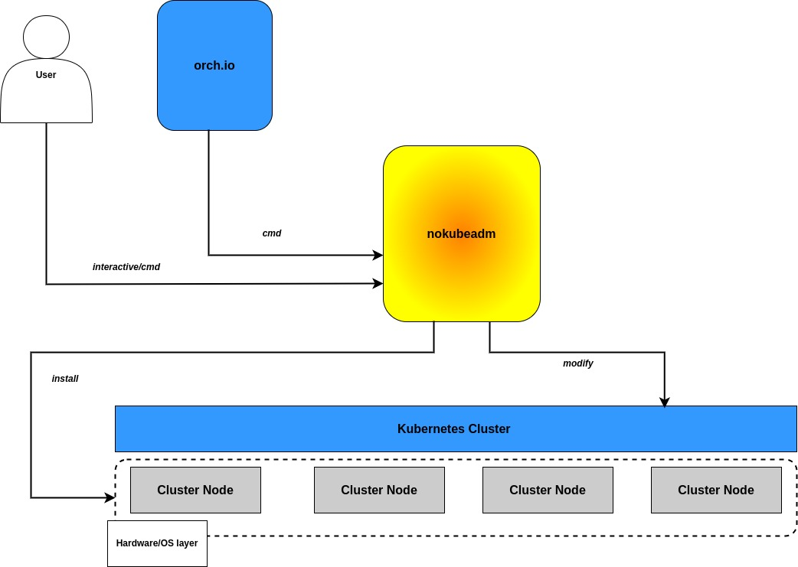

# nokubeadm


[Overview](#overview)\
[Functionalities](#functionalities)\
[How to use](#how-to-use)




## Overview

What this piece of code does is to handle a request for the fundamental processes to set up\
and modify Kubernetes cluster from scratch either interactively or not (via remote request made\
by nokubectl)\
Using this piece of code, a user doesn't have to care about the details of setting up and feeding\
proper arguments for their specific hardware and operating system when installing and modifying\
a Kubernetes cluster, abstracting away one of the most challenging part in the whole process of\
orchestrating container lifecycle across multiple clusters


## Functionalities

1. Auto-detect a user-specified target environment and apply a set-up process according to the decision

nokeadm has the ability to auto-detect the environment information it runs on, hence reducing\
the need for user-provided arguments in determining and checking the validity of a specific\
set-up or modification command, which is inherently more error-prone and anti-abstract\
way of doing things 


2. Execute the set-up and modification process in a multi-threaded and roll-back possible way, enhancing status control, debugging experience and success rate

nokubeadm supports out-of-the-box multi-threaded execution of the set-up and modification\
process, while managing the process in an atomic way of success or failure, henceforth making\
it possible to promptly feedback the current status of pipeline and overlay upon the previous\
status, including stripping away the previous layer (rollback) 


3. Dynamically loading and updating set-up and modification pipelines, enhancing a more prompt, seamless security and feature updates

nokubeadm chooses its online repository as its default pipeline storage, making it possible to\
promptly update the broken, faulty, or outdated pipeline in a single request 

4. Supporting both interactive mode and execution mode, giving more freedom on how to interface

By default, nokubeadm works at the hook relayed by orch.io from the request made by nokubectl.
However, it is also possible for users to issue a desired command at their will on the machine.

## How to use


Precompiled binaries are available at [here](https://github.com/OKESTRO-AIDevOps/nkia/releases)

Or, you can compile it by yourself using the following commands

```shell


git clone https://github.com/OKESTRO-AIDevOps/nkia.git

cd nkia

make release 

# or 
# `make build`
# if you just want to compile a binary without
# configuring essential environment

```

There are a few requirements before actually using nokubeadm depending on how\
you would want to use this cmd tool

**With nokubectl**

1. A running orch.io server 
2. A private key file located at .npia/ directory which has been generated in advance from orch.io server
3. At least one Kubernete cluster or one server pool to become Kubernetes cluster, because NKIA project supports Kubernetes installation


**Without nokubectl**

1. At least one Kubernetes cluster or a server pool to becomd Kubernetes cluster
2. nokubeadm binary on that cluster or server pool

Use ./nokubadm command to get further detailed help 


