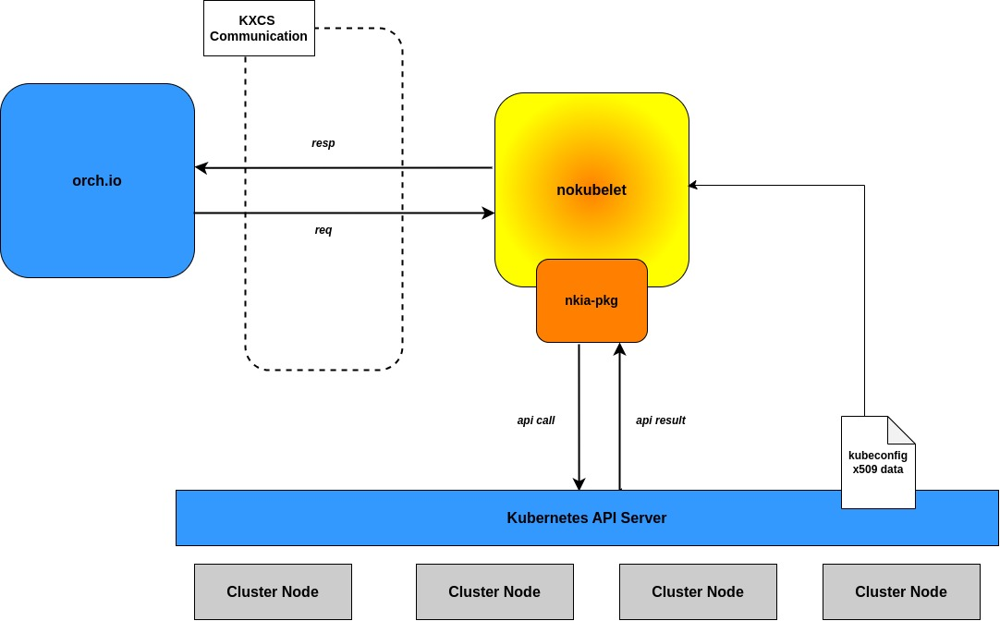

# nokubelet


[Overview](#overview)\
[Functionalities](#functionalities)\
[How to use](#how-to-use)




## Overview

What this piece of code does is to receive request relayed by orch.io from nokubectl and process\
the actual target command intended for the specific Kubernetes cluster that this nokubelet\
binary is running on, then send the result to the end issuer of the command (in this case \
nokubectl)\
Using this piece of code, a user can securely and seamlessly connect a running Kubernetes\
cluster (either set up by user's own process or nokubeadm) to orch.io server, and then \
have an intended command for that particular cluster to run on it even without an immediate\
access to the cluster, henceforth making it possible to orchestrate multiple Kuberntes clusters\
using various load balancing algorithms (primarily intended for round-robin)


## Functionalities

1. Automatic updates in authentication method and continuous x509 communication based on the available Kubernetes config file

nokubletet is connected to orch.io in an abstracted way which adopts the full use of Kubernetes config file under the hood. Except for the very first time it is connected to orch.io server where\
it uses OTP token to identify itself with the server, nokubelet supports continuous and seamless\
certificate update method under the hood so that the user doesn't have to care about the\
periodic revolving between the new Kubernetes config file and the old one in accordance with\
Kubernetes certificate renewal cycle.

Connect only once, and you're good to go ever affter(even this is not necessary as nokubectl\ installation process all handles it for you)

2. Handling container lifecycle management command issued by nokubectl, in a multi-threaded and atomic way

nokubelet supports multi-threaded execution of the inteded query for the Kubernetes cluster that\
this binary is running on, thus making it possible for a user to check the execution status of\
the time-consuming task running on a specific cluster in an (almost) real-time way.\
It also provides a relatively straight forward way to roll back the previously successful query. 

The most visible benefit of harnessing the use of nokubelet is that now a user has the reliable \
backend more suitably organized to support the multi-cluster visibility layer provided by\
nokubectl & orch.io. 

3. Daemonized execution and auto recovery

nokubelet runs as a daemon that is periodically checked its validity by shell, henceforth making\
it more durable to unexpected interrupt


## How to use


Precompiled binaries are available at [here](https://github.com/OKESTRO-AIDevOps/nkia/releases)

Or, you can compile it by yourself using the following commands

```shell


git clone https://github.com/OKESTRO-AIDevOps/nkia.git

cd nkia

make release 

# or 
# `make build`
# if you just want to compile a binary without
# configuring essential environment

```

There are a few requirements before actually using nokubelet 


1. A running orch.io server 
2. At least one Kubernete cluster either set up by user's own process or nokubeadm
3. If it's the very first time you're connecting nokubelet to orch.io, the OTP token issued by orch.io