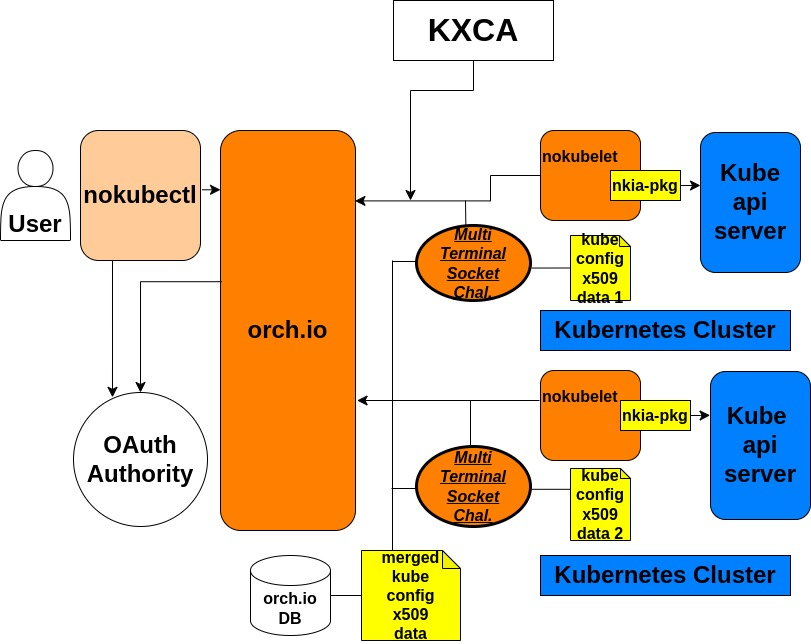
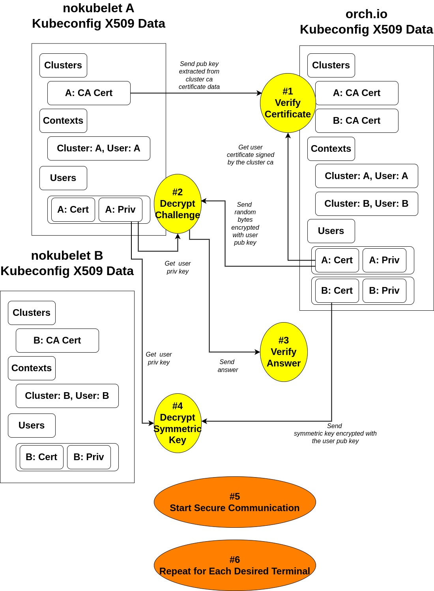

# orch.io


[Overview](#overview)\
[Functionalities](#functionalities)\
[How to use](#how-to-use)








## Overview


What this piece of code does is to handle a request made by nokubectl (or its \
equivalent compling with the spec) by relaying it to the proper target Kubernetes\
cluster connected via nokubelet and retrieving the result from it.\
Using this piece of code, a user can have an abstraction layer that shall be called\
"visibility layer" upon the backend for managing physically separated (or not)\
multiple Kubernetes clusters, making managing multiple clusters a more\
doable task as managing a several host machines behind a reverse proxy\
load balancer 


## Functionalities


1. Http(s) server that serves as terminal for registering and modifying the user pool for a set of Kubernetes clusters 

orch.io works as the most basic https server for all the incoming requests that \
ask for registration with the whole NKIA system or for further permission to \
interact with the system.
It has (for now) Google OAuth2 as its primary registration and manager login \
gateway, and lets a user generate private key for interacting with the NKIA \
project using nokubectl (or its equivalent)


2. Web socket(s) hub that serves as the primary interface for communication between nokubectl (or its equivalent) and Kubernetes clusters connected to orch.io via nokubelet daemon

orch.io works as a core bridge to send and receive real-time requests and responses\
between nokubectl and the Kubernetes clusters connected via nokubelet daemon.\
It does so without putting too much burden on user side when it comes to security\
by enabling a novel protocol called KXCS that is Kubeconfig x509 data based Channel\
Security 


3. Kubeconfig x509 data based Channel Security

- In order for this protocol to be successfully resolved, server sock must have \
  only one, exact, and whole subset of the orchestrator side's kubeconfig file.

*Going forward, server sock will be referred to as "client" and orchestrator\
will be referred to as "server"*

- According to its contexts field, client extracts the certificate-authority-data's \
  public key, which is kubernetes root ca's public key, and sends it with a corresponding\
  context cluster name.\
  Now, upon receiving that information, server verifies if the public key is\
  the one that it has by using the key to verify the context user's certificate,\
  which is supposed to be signed using kubernetes root ca's private key if authentic.

- Now, if the verification is successful for ethe user's certificate,\
  it's time for server to assign a challenge id and random bytes of 16 - 32 length for \
  the context user, store it, encrypts the random bytes using each context\
  user's public key, which can be extracted from the kubeconfig context user's certificate\
  data, and sends the data back to client.\
  Upon receiving this, client must remember the challenge id and for the context user,\
  decrypt the challenge with corresponding private key which is accessible\
  from the kubernetes context user's private key data.


- If the challenge is decrypted, client sends the answer attached to the\
  challenge id it received.


- If the challenge is correctly decrypted, server then assumes that the \
  counterpart has the one, exact, and whole subset of kubeconfig file that it has and\
  generates a session key for the client,\
  pairs it with the session's unique symmetric key for AES-GCM algorithm, encrypts\
  the key with the context user's public key, and finally sends it back\
  to the client with the context user name as a field key.


- Finally, upon receiving it, client decrypts the data with the corresponding private\
  key of the user, stores the symmetric key, and starts encrypting the communication data. 


- From server's point of view, if there are more than one client terminal, it iterates\
  the process for each terminal that wants to connect to the server.

## How to use


Precompiled binaries are available at [here](https://github.com/OKESTRO-AIDevOps/nkia/releases)

Or, you can compile it by yourself using the following commands

```shell


git clone https://github.com/OKESTRO-AIDevOps/nkia.git

cd nkia

make release 

# or 
# `make build`
# if you just want to compile a binary without
# configuring essential environment

make run

```


There is one requirement before actually using orch.io

1. Working Google OAuth2 Client config file "config.json" as described in config.json.tmpl 