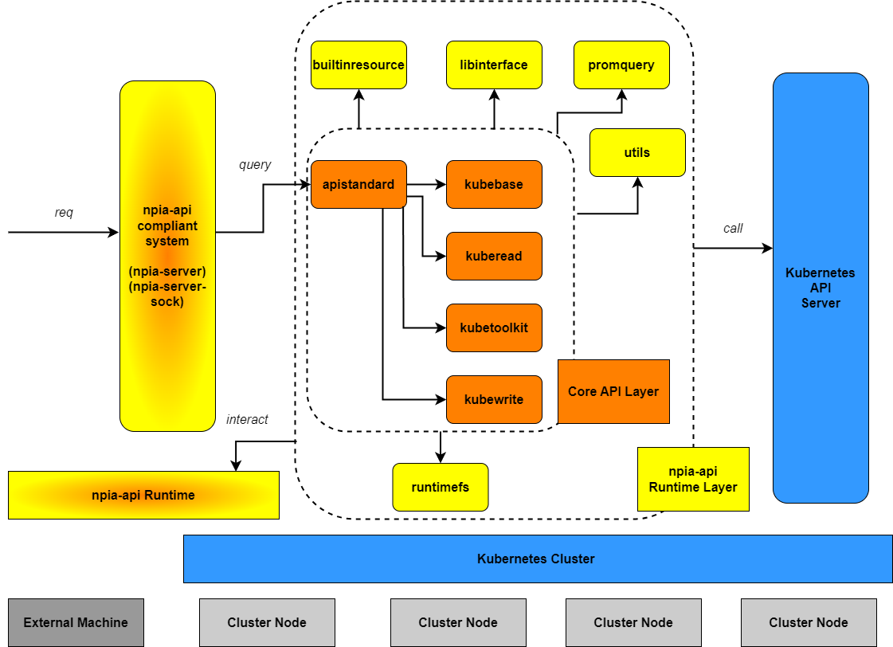

# npia-api

- [Implemented Use Cases](#implemented-use-cases)
- [Description](#description)
- [Project Overview](#project-overview)
- [Details](#details)


## Implemented Use Cases

1. [Secured Server for both http request and web socket request (hub)](https://github.com/OKESTRO-AIDevOps/npia-server)

2. [Http client in Golang](https://github.com/OKESTRO-AIDevOps/npia-go-client)


## Description

As this project's unofficial name suggests, this repository tries to achieve ease of use when interacting with Kubernetes clusters\
by setting up importable api endpoints that can be seamlessly called and used by executables or external libraries.

Be cautioned that those api endpoints are not the original Kubernetes api themselves, but an abstracted layer that often bundles\
some of the core functions related to the original kubeapi in order to provide the users with a pseudo pipeline for managing various\
Kubernetes cluster operating tasks including 

1. reading cluster node and application information (powered in part by Prometheus)

2. writing desired lifecycle status to the cluster, which involves not only deployment but also updating, rolling-back, deletion and even\
    qos management and auto-scaling

3. building and preparing the targets of deployment (or the applications) with user-supplied info into a Kubernetes-deployable apps (thanks to Kompose)

4. configuring and managing user-information without too much hassle on user side


## Project Overview

The blueprint for the repository is as follows.



The tree structure for the repository is as follows.

```bash
├── docs
├── go.mod
├── go.sum
├── lib
│   ├── bin
│   └── scripts
├── LICENSE
├── pkg
│   ├── apistandard
│   ├── builtinresource
│   ├── kubebase
│   ├── kuberead
│   ├── kubetoolkit
│   ├── kubewrite
│   ├── libinterface
│   ├── promquery
│   ├── runtimefs
│   └── utils
├── README.md
├── test
│   ├── kindcluster
└── var

```

Let me guide you through the each entrypoint briefly.

- docs\
  Is what it says it is.

- go.mod, go.sum\
  Define the directly and indirectly required modules for functioning apis.

- lib\
  Stores the third-party libraries which consist mainly of executables (not shared libraries for now) and scripts.\
    This directory is available at this repository's Release list and gets downloaded in runtime so that the user\
    doesn't have to do it by him or herself.


- [lib/bin](#lib-bin)\
  Stores the third-party executables.\
    The current componenets that make up this directory are docker-compose and kompose

- [lib/scripts](#lib-scripts)\
  Stores the scripts to manage somewhat cluster-external tasks such as installing helm chart manager \
  and installing Prometheus through Helm, accorging to current directory contents.

- LICENSE\
  Is what it says it is.

- pkg\
  Has the importable apis that act as an abstraction layer for the original kubeapi functions and also miscellaneous tasks\
  that make upon/up the abstraction.  

- [pkg/apistandard](#pkg-apistandard)\
  Has the main entry point for all apis along the definition of all the api I/O data formats and structures of all available\
  api commands.

- [pkg/builtinresource](#pkg-builtinresource)\
  Has the Kubernetes resource manifestations that are used in this project.

- [pkg/kubebase](#pkg-kubebase)\
  Has the tools to set up a general Kubernetes management and deployment requirements.

- [pkg/kuberead](#pkg-kuberead)\
  Has the tools to read from the cluster the desired information such as node, pod running status\
  at times with visualization available. 

- [pkg/kubetoolkit](#pkg-kubetoolkit)\
  Has the tools to (primarily) build and prepare container images specified by user and turn it \
  into a cluster deployable manifests.  

- [pkg/kubewrite](#pkg-kubewrite)\
  Has the tools to write to clusters the information that is usually Kubernetes manifests under \
  the hood.

- [pkg/libinterface](#pkg-libinterface)\
  Provides other functions with the interface to interact with the executables and scripts in lib \
  directory.

- [pkg/promquery](#pkg-promquery)\
  Provides (primarily) pkg/kuberead and others with the interface to query to and retrieve standardized \
  visualization data from Prometheus server. 

- [pkg/runtimefs](#pkg-runtimefs)\
  Provides other functions with the interface to read and write from user-specific directory that holds\
  information such as user Git and registry credential and cluster topology.

- [pkg/utils](#pkg-utils)\
  Has the utilities that can be imported universally to handle granular tasks across the whole project.

- test\
  Store the test materials for each entrypoint

- test/kindcluster\
  Has the scripts and tools to set up a kindcluster for debugging and testing

- var\
  Has various this and that artifacts when developing the apis

## Details

This section dives into the details of each entry point.

However, it doesn't go so deeper that you don't have to look at the source code to understand\
how everything works in conjunction.

For even more details, refer to specific comments associated with a code block, or better,\
you could just run it yourself.

### lib bin

- docker-compose\
  Is an executable for building application into container images (provided that you already have\
  Dockerfile or images) and running them as manifested in a yaml file.\
  In this project, the executable is used for building the cloned git repository which already has\
  docker-compose.yml or docker-compose.yaml file. 
  Github link is as follows:\
    [Github:docker-compose](https://github.com/docker/compose)

- kompose\
  Is an executable for converting a docker-compose manifest file into a Kubernetes deployable manifest\
  , though some additional modification to the output Kubernetes manifest might be needed in order to\
  suit the exact need for each distinct use case.\
  In this project, the executable is used for creating user-specific operation source file which\
  is used by various functions across the project, namely runtimefs.
  Github link is as follows:\
    [Github:kompose](https://github.com/kubernetes/kompose)

> Examples

### lib scripts

- admin_init_dependency\
  Is a Bash shell script that contains command lines for installing and setting external libraries or\
  packages that are used by this project but not explictly included in the project tree path as in case\
  of lib/bin. \
  Currently, the only dependency handled by this script is Helm chart manager.


- prom_create
  Is a Bash shell script that contains command lines for installing and setting Prometheus server onto\
  the target cluster specified by kubeconfig at times of execution and runs in background as a demon to\ maintain the connection to a port-forwarded Prometheus server endpoint.


### pkg apistandard

- legacy.go\
  Defines and implements legacy npia api call translator and data structures so that the legacy\
  api calls can use npia-api without modification to their already in-use system.\
  **Caveats: it must NOT be blindly assumed that all npia legacy api calls can be made to this translator\
  as strict testing has not been conducted so far at the time of writing**

- metadata.go\
  Defines and implments the functions that construct and return proper HEAD information per request.

- standard_definition.go\
  Defines all npia api data structures compliant with the current latest version.\
  The data structures include effective api command, api metadata format, api input/output format,\
  and runtime-callable api command struct, which is declared, as a default, \
  Asgi(Api Standard Gateway Interface).

- standard_lib.go\
  Defines and implements common functions for handling proprocessing of the apistandard main function\ which include checking validity of the api input format and linear instruction conversion.

- standard_main.go\
  Defines and implements a real tedious lines after lines of abstracted api entries\
  Commented out entries are to be implemented in future versions
  


### pkg builtinresource

- resource_definition.go\
  Self explanatory. It defines the Kubernetes manifest resource such as Deployment, Service, Ingress,\
  NodePort, HorizontalPodAutoscaler that are used across the whole project, but mainly by runtimefs.


### pkg kubebase

- admin.go\
  Has functions regarding the initiation, installation, and removal of the npia **release** mode\
  (not **test** mode, test mode is handled by runtime script named "debug_build_run" or something \
  like that).\
  Since initiation involves downloading lib release over the internet, it is recommended to run it\
  in Goroutine, and is implemented so in this project.


- setting.go\
  Has functions for managing information that is not directly applied to the cluster but needed\
  in later stages when users intend to deploy or modify the cluster manifests or resources.\
  The functions include setting a namespace (yes, this one directly applied to the cluster I know),\
  and setting repository and registry information in the runtimefs and creating monitoring (Prometheus server)\ endpoint.     


### pkg kuberead

- read.go\
  Has functions for reading cluster information including node and pod runtime data.\
  It usually deals with plain kubectl command line tool but is planned to be replaced with\
  Kubernetes [client-go](https://github.com/kubernetes/client-go) before too late (let's hope!)\
  And also, some of the functions that are deemed to be better off with visualization and time-series\
  enabled work in conjunction with Prometheus server endpoint, such container or node network received\
  bytes over time or something equivalent to that.  


### pkg kubetoolkit

- toolkit.go\
  Has functions for building images from the supplied docker-compose manifest file and push them\
  to the user supplied image registry. For now, that's pretty much everything it has.\
  Oh, and also, for some obvious reasons, building images can take a significantly longer period of\
  time compared to other tasks handled by npia-api. Therefore, it is also recommended to run the \
  build function in a Goroutine, and is implemented so in this project.


  

### pkg kubewrite

- write.go\
  Has functions for actually applying the previously-fed information or manifest to the cluster.\
  Tasks include applying secrets to a specific cluster namespace, deploying the previously-built\
  images based on a operation source file (which is a fancy alias for kompose-generated and \
  npia-customized manifest file), managing lifecycle of the microservices (or however you call them)\
  , qos, and auto-scaling of them.\
  This one here also, as the case for the kuberead part, is planned to incorporate\
  Kubernetes [client-go](https://github.com/kubernetes/client-go) before too late (fingers crossed!)   

### pkg libinterface

- interface_call.go\
  So far, this one has only one function and that is the function to get the absolute path of\
  a executable or script by its name and directory (either bin or scripts at this point)


- interface_definition.go\
  So far, it only has one function that prepares a library interface data type that is pratically\
  just a mapped container for library directory structure. 
  


### pkg promquery

- query_definition.go\
  Defines as exportable variables the raw Prometheus api queries (yuuuuuukkk...)

- query_handler.go\
  Handles each Prometheus api query, retrieves results, and finally standardizes the results in a format\
  that can be fed to the uniform npia output.

- query_lib.go\
  Has an actual Post method implemented to query Prometheus server endpoint, and standardizing function\
  for creating a output-sendable uniform data structure, and sanitizing function to check if targeted \
  namespace formate is valid.


### pkg runtimefs

- dotetc_handle.go\
  Interacts primarily with files residing in .etc in the runtime location.\
  It creates, loads and dumps the user-specific credentials and checks, adds, and modifies \
  the records within the file.

- dotetc_structure.go\
  Has all the data structures for interacting with the .etc files

- dotusr_images.go\
  Has all functions to create, modify, and delete the user-specific files that are used when\
  building and pushing images in .usr directory in the runtime location.  

- dotusr_share.go\
  Has all functions to create, modify, and delete the operation source file that is used when\
  deploying the application and managing application lifecycle including qos and auto-scaling 

- dotusr_source.go\
  Based on the operation source file, creates applicable manifest files whose tasks include\
  application and revocation of auto-scaling, qos, ingress, nodeport so and so.


### pkg utils

- utils.go\
  Are basic utilities that Golang itself refuses to offer (not that I don't like it though!	⊙ω⊙ ).
  

