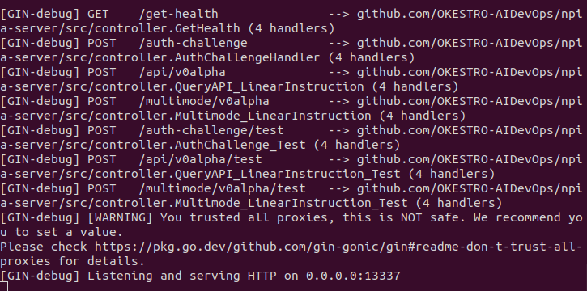
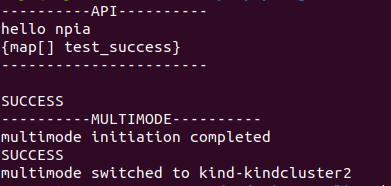
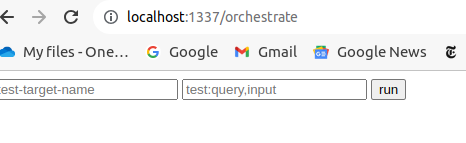
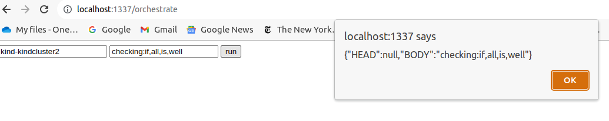
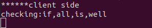

# npia-server: Scenario

- [Description](#description)
- [Single Terminal Transfer Communication Mode](#single-terminal-transfer-communication-mode)
- [Multi Terminal Socket Communication Mode](#multi-terminal-socket-communication-mode)

## Description

This page is about basic examplary scenarios for each mainline use cases & implementations of

1. KCXD-STTC (Kubeconfig X509 Data based Single Terminal Transfer Communication)

2. KCXD-MTSC (Kubeconfig X509 Data based Multi Terminal Socket Communication)

## 1. Single Terminal Transfer Communication Mode 

### 1-1. Initiate npia-server STTC mode

In the below screenshot, you can see the gogin server is running\
in debug mode, showing all available endpoints.\
Here, our points of interest are those suffixed with /test paths since,\
yes, this is a test.

### 1-2. Run npia-go-client debug script for STTC mode test client

In the below screenshot, what you see is the npia-go-client's piece of script\
where you can check out a simple test interaction with the npia-server in\
STTC mode which involves single terminal transfer challenge and api querying.

### 1-3. Check if the STTC Challenge Protocol and subsequent api queries have been successful 

In the below screenshot, you can see that the first two requests have been made to\
resolve challenge protocol authentication and the following api query, followed by\
two more queries to initiate multi mode and then switch to another target cluster.\
We can be sure the challenge was succefult since the latter three requests never return\
200 status in the case of unsuccessful authenticaton.

### 1-4. Check if the STTC client has received what it wanted

Voila, it has!

## 2. Multi Terminal Socket Communication Mode

### 2-1. Initiate npia-server MTSC mode 

In the below screenshot, you can see the orchestrator components are \
up and running as containers.

### 2-2. Initiate npia-server MTSC socket client

With a manually compiled src executable, using the below command will make\
a debugging connection to the orchestrator 

### 2-3. Check if MTSC Challenge Protocol has been successful and connection is maintained

If the challenge protocol has been successful and connection is \
accepted, you will see something like the below screenshot.

### 2-4. As a front-user, conduct oauth2.

As the below screenshot, you will see the page popping up if you first access the default\
path.

### 2-5. If OAuth is successful, you are ready to orchestrate multiple terminals

Just like the below screenshot, you will have an interface to query multiple terminals\
manifested and connected to the orchestrator.

### 2-6. Meanwhile, check if front connection was successful.

If the oauth has been successful and connection to the orchestrator is \
accepted, you will see something like the below screenshot.

### 2-7. Now, let's see what happens if we actually make a query

As you can see, feeding proper arguments into the input fields and hitting run,\
the requested message will travel through the orchestrator, making it to the other\
side, getting processed, and travel back through the orchestartor to reach the \
client browser.

### 2-8. Check if the message touched the orchestrator

You can see it reached the front handler and got sent to the sock client.

### 2-9. Check if the message reached the npia-server MTSC mode client

Yep, all good.

