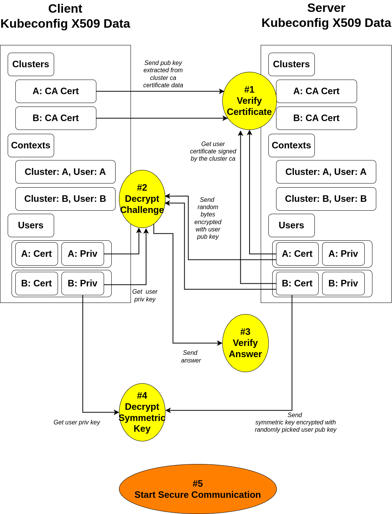
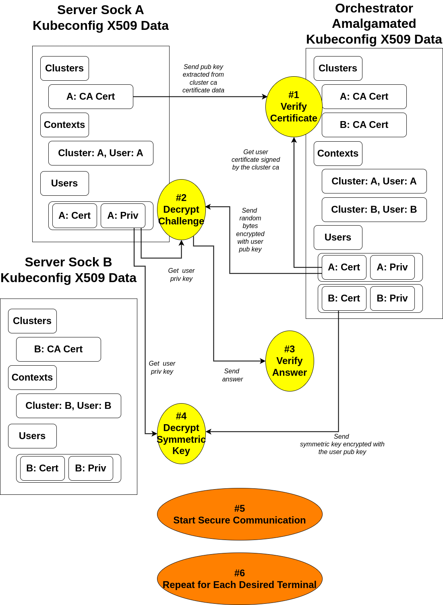

# npia-server: Security

- [Warning](#warning)
- [Description](#description)
- [Overview](#overview)
- [Details](#details)
- [Where Is The Code?](https://github.com/OKESTRO-AIDevOps/npia-server/blob/main/src/modules/auth.go)

## Warning

**1. DO NOT USE PLAIN HTTP CHANNEL WHEN ACCESSING FRONT, YET!**

**2. DO USE YOUR OWN OAUTH CREDENTIAL!**

## Description

This page is about the problematic bogus words appearing excessively frequently \
throughout the whole documents,

1. KCXD (Kubeconfig X509 Data)\
  Under the hood, when executing kubectl command, a thing called Bidirectional X509\
  between kubectl client and kube apiserver happens to authenticate mutual integrity.\
  Kubeconfig is used for that protocol and npia-server decided to build a protocol\
  upon the data which is assumed to be sharable (or not! haha) if client and server are\
  set up by the same entity. 

2. STTC (Single Terminal Transfer Challenge, or Communication)\
  Using KCXD, it is a protocol between http client and server which targets \
  single-terminal oriented requests and responses.

3. MTSC (Multi Terminal Socket Challenge, or Communication)\
  Using KCXD, it is a protocol between front and orchestrator and sock client which\
  targets multi-terminal oriented web socket requests and responses.

## Overview

The blueprint for KCXD Challenge Protocol is as follows

# 1. STTC (Single Terminal Transfer Challenge)

# 2. MTSC (Multi Terminal Socket Challenge)

## Details

### STTC (Single Terminal Transfer Challenge)

0. In order for this protocol to be successfully resolved, client and server \
  must share the exactly same kubeconfig files.

1. According to its contexts fields, client extracts all available\
   certificate-authority-data's public keys, which are kubernetes root ca's \
   public keys, and sends them all with each corresponding context cluster name.\
   Now, upon receiving that information, server verifies if the public keys are\
   the ones that it has by using those keys to verify the context user's certificates,\
   which are supposed to be signed using kubernetes root ca's private keys if authentic.

2. Now, if the verification is successful for each and every user's certificate,\
  it's time for server to assign a challenge id and random bytes of 16 - 32 length for \
  each and every context user, store it, encrypts the random bytes using each context\
  user's public key, which can be extracted from the kubeconfig context user's certificate\
  data, and sends the data back to client.\
  Upon receiving this, client must remember the challenge id and for each and every entry\
  of context user, decrypt the challenge with corresponding private keys which are accessible\
  from the kubernetes context user's private key data.

3. If each and every challenge is decrypted, client sends the answer attached to the\
  challenge id it received.

4. If each and every challenge is correctly decrypted, server then assumes that the \
  counterpart has the same kubeconfig file and generates a session key for the client,\
  pairs it with the session's unique symmetric key for AES-GCM algorithm, encrypts\
  the key with randomly picked context user's public key, and finally sends it back\
  to the client with the context user name as a field key.

5. Finally, upon receiving it, client decrypts the data with the corresponding private\
  key of the user, stores the symmetric key, and starts encrypting the communication data. 

   

### MTSC (Multi Terminal Socket Challenge)

0. In order for this protocol to be successfully resolved, server sock must have \
  only one, exact, and whole subset of the orchestrator side's kubeconfig file.

*Going forward, server sock will be referred to as "client" and orchestrator\
will be referred to as "server"*

1. According to its contexts field, client extracts the certificate-authority-data's \
  public key, which is kubernetes root ca's public key, and sends it with a corresponding\
  context cluster name.\
  Now, upon receiving that information, server verifies if the public key is\
  the one that it has by using the key to verify the context user's certificate,\
  which is supposed to be signed using kubernetes root ca's private key if authentic.

2. Now, if the verification is successful for ethe user's certificate,\
  it's time for server to assign a challenge id and random bytes of 16 - 32 length for \
  the context user, store it, encrypts the random bytes using each context\
  user's public key, which can be extracted from the kubeconfig context user's certificate\
  data, and sends the data back to client.\
  Upon receiving this, client must remember the challenge id and for the context user,\
  decrypt the challenge with corresponding private key which is accessible\
  from the kubernetes context user's private key data.

3. If the challenge is decrypted, client sends the answer attached to the\
  challenge id it received.

4. If the challenge is correctly decrypted, server then assumes that the \
  counterpart has the one, exact, and whole subset of kubeconfig file that it has and\
  generates a session key for the client,\
  pairs it with the session's unique symmetric key for AES-GCM algorithm, encrypts\
  the key with the context user's public key, and finally sends it back\
  to the client with the context user name as a field key.

5. Finally, upon receiving it, client decrypts the data with the corresponding private\
  key of the user, stores the symmetric key, and starts encrypting the communication data. 

6. From server's point of view, if there are more than one client terminal, it iterates\
  the process for each terminal that wants to connect to the server.